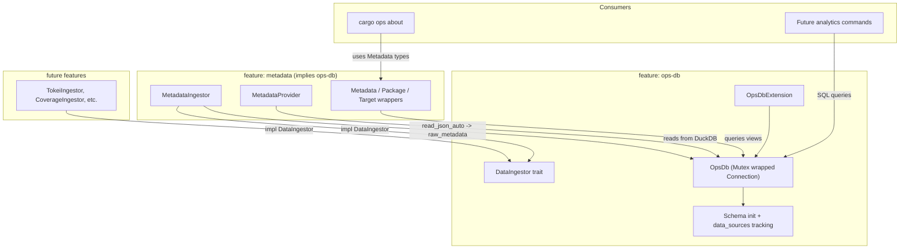

# DuckDB Data Collection Architecture Plan

## Context

Currently, the metadata extension (`src/extensions/metadata/`) runs `cargo metadata --format-version 1`, parses the JSON output into a `serde_json::Value`, and caches it in-memory per session via the `DataProvider` trait and `Context.data_cache`. Other extensions like `about` consume this data through typed accessor wrappers (`Metadata`, `Package`, etc.).

This plan introduces DuckDB as a persistent, queryable data layer. The reference projects (`xdash-data`, `xdash`) demonstrate proven patterns: raw JSON ingestion via `read_json_auto()`, normalized views in SQL, typed Rust query methods, and checksum-based incremental loading.

---

## Architecture Overview



---

## Database Location and Lifecycle

**Default:** Each project gets its own database at `{workspace_root}/target/cargo-ops/data.duckdb`. This is automatic -- zero config needed. The file lives inside `target/`, so it's gitignored by default and cleaned by `cargo clean`.

**Override:** Users can point to any path via `[data].path` in `.ops.toml`:

```toml
[data]
path = "/home/me/.local/share/cargo-ops/shared.duckdb"   # absolute path
# or
path = ".ops-data/project.duckdb"                         # relative to workspace root
```

This single knob gives the user full control. Want a shared database across projects? Point multiple projects to the same file. Want the default per-project isolation? Don't set anything.

**Path resolution:**

- If `[data].path` is **not set** (default): `{workspace_root}/target/cargo-ops/data.duckdb`
- If `[data].path` is **absolute**: used as-is
- If `[data].path` is **relative**: resolved relative to `workspace_root`
- `[data].path` follows the standard config merge order: internal default (not set) -> global config (`~/.config/cargo-ops/config.toml`) -> local `.ops.toml` -> env var `CARGO_OPS_DATA__PATH`

**Lifecycle:**

- **Created lazily** on first access; parent directories auto-created
- **Thread safety:** `OpsDb` wraps `Mutex<duckdb::Connection>` (same pattern as xdash-data)
- **Schema:** The `data_sources` tracking table always includes `workspace_root` for provenance, regardless of where the DB lives

---

## Module Structure

Each extension is its own folder under `src/extensions/`, gated behind a Cargo feature:

```
src/
  extensions/
    mod.rs                      # conditional re-exports, feature-gated registration
    ops_db/                     # feature: "ops-db"
      mod.rs                    #   OpsDbExtension, re-exports
      connection.rs             #   OpsDb struct, open/open_readonly, resolve_path
      schema.rs                 #   Schema initialization (data_sources tracking table)
      error.rs                  #   DbError enum, DbResult<T> type alias
      ingestor.rs               #   DataIngestor trait, LoadResult
    metadata/                   # feature: "metadata" (implies "ops-db")
      mod.rs                    #   MetadataExtension, re-exports
      ingestor.rs               #   MetadataIngestor (DataIngestor impl)
      provider.rs               #   MetadataProvider (DataProvider impl, backward compat)
      types.rs                  #   Metadata, Package, Dependency, Target wrappers
      views.rs                  #   SQL view definitions for raw_metadata
```

The `extensions/mod.rs` uses conditional compilation so that `ops-db` is registered first, then `metadata`, with the DB path resolved from config and workspace root.

---

## Key Types and Traits

### 1. `OpsDb` -- Connection Wrapper

Located in `src/extensions/ops_db/connection.rs`. Mirrors the xdash-data pattern:

- **Open (or create)** a database at the given path, read-write; **open_readonly**; **open_in_memory** (for tests).
- **path()** returns the resolved path; **lock()** for exclusive use.
- **resolve_path(config, workspace_root)** is a pure function: no override -> `workspace_root/target/cargo-ops/data.duckdb`; absolute override -> as-is; relative override -> `workspace_root.join(path)`.

### 2. `DataIngestor` Trait

Located in `src/extensions/ops_db/ingestor.rs`. Each data source implements:

- **name()** — unique source name (e.g. `"metadata"`, `"tokei"`).
- **collect(ctx, data_dir)** — run external commands, write JSON (or other raw data) under `data_dir`.
- **load(data_dir, db)** — load collected data into DuckDB tables/views.
- **checksum(data_dir)** — for skip-if-unchanged logic.

The collect + load two-phase design separates data acquisition from ingestion.

### 3. `OpsDbExtension` and `OpsDbProvider`

`OpsDbExtension` implements `Extension` and registers an `"ops_db"` data provider. The provider opens (or returns cached) the database and sets `Context.db` so other extensions can access the DB handle.

### 4. `DbError` and `DbResult`

Structured errors in `src/extensions/ops_db/error.rs` (MutexPoisoned, DuckDb, Io, QueryFailed, Serialization). `DbResult<T> = Result<T, DbError>`.

---

## Schema Design

### Tracking Table: `data_sources`

Composite primary key `(source_name, workspace_root)`. Columns: `source_name`, `workspace_root`, `loaded_at`, `source_path`, `record_count`, `checksum`, `metadata` (JSON). Used for checksum-based skip logic.

### Metadata Source

- **metadata_cache** — table keyed by `workspace_root`, stores `json_text` for backward-compatible `Metadata` provider.
- **raw_metadata** — table created via `read_json_auto(path, maximum_object_size=67108864)` from the metadata JSON file.

Normalized views (e.g. `workspace_crates`, `dependencies`, `targets`) can be added later on top of `raw_metadata`.

---

## Metadata Extension Refactoring

**Before:** Runs `cargo metadata`, parses JSON, caches in `Context.data_cache` as `serde_json::Value`.

**After:**

1. Implements `DataIngestor`: `collect()` runs `cargo metadata --format-version 1` and writes `metadata.json` under the data dir; `load()` creates `metadata_cache` and `raw_metadata`, upserts `data_sources`.
2. Registers the existing `DataProvider` ("metadata") for backward compatibility. The provider tries DuckDB first (collect, checksum, load if needed, read `json_text` from `metadata_cache`), then falls back to direct `cargo metadata` execution if DB is not available.
3. Typed wrappers (`Metadata`, `Package`, `Dependency`, `Target`) remain unchanged; `Metadata::from_context()` continues to work.

---

## Data Flow

1. CLI sets up extensions; `builtin_extensions(config, workspace_root)` returns ops-db then metadata; DB path from `OpsDb::resolve_path(&config.data, workspace_root)`.
2. When metadata is requested, the metadata provider ensures `ops_db` is provided first (so `Context.db` is set). It then tries DuckDB: collect to `metadata.json`, checksum, compare with `data_sources`, load if needed, then read `metadata_cache.json_text`.
3. If DuckDB is not used or load fails, the provider falls back to running `cargo metadata` and caching the result in `data_cache`.

---

## Extension Registration Order

In `setup_extensions()` in `src/main.rs`, extensions come from `builtin_extensions(config, workspace_root)`. Ops-db is registered before metadata so that when the metadata provider runs, it can access `Context.db` after `get_or_provide("ops_db")`.

---

## Configuration

`[data]` section in `src/config.rs`: `DataConfig { path: Option<PathBuf> }`. Merged via overlay; default is no override. The `.ops.toml` template from `cargo ops init` can include a commented hint for `[data].path`.

---

## Dependency and Feature Changes

- **Features:** `default = ["ops-db", "metadata"]`, `ops-db = ["dep:duckdb", "dep:sha2", "dep:hex"]`, `metadata = ["ops-db"]`.
- **Optional deps:** `duckdb` (bundled), `sha2`, `hex`. **Always-on:** `thiserror`.

`cargo build --no-default-features` produces a lean build without DuckDB or the metadata ingestor.

---

## Context Changes

`Context` has an optional DB handle when the `ops-db` feature is enabled: `db: Option<Arc<dyn OpsDbHandle>>`. The erasure trait allows the core extension module to avoid depending on the concrete `OpsDb` type; extensions that need `OpsDb` downcast via `as_any()`.

---

## Testing Strategy

- **Unit tests (ops-db):** In-memory DB for schema init, path resolution (default, relative, absolute), get/upsert `data_sources` checksum.
- **Config tests:** `[data].path` parses and merges correctly.
- **Metadata tests:** Existing metadata/package/target tests; provider fallback in non-cargo dir.
- **No-feature build:** `cargo build --no-default-features` compiles cleanly.

---

## Migration Path (Completed)

1. Cargo features and optional deps; `--no-default-features` build.
2. `src/extensions/ops_db/`: OpsDb, DataIngestor, error, schema.
3. Metadata moved to `src/extensions/metadata/`; MetadataIngestor; MetadataProvider reads from DuckDB with fallback.
4. `about` and other commands use Metadata types unchanged.
5. Future: additional ingestors (tokei, coverage, etc.) following the same pattern.

---

## Open Design Decisions

- **Data directory cleanup:** A `cargo ops db reset` (or similar) for custom DB paths could be useful; for the default path, `cargo clean` suffices.
- **Shared DB scoping:** When multiple projects use the same `[data].path`, `data_sources` tracks `workspace_root`. Whether views should auto-filter to the current project or allow cross-project queries is open.
- **Async:** DuckDB is synchronous; if async is needed later, wrap calls in `spawn_blocking`.
